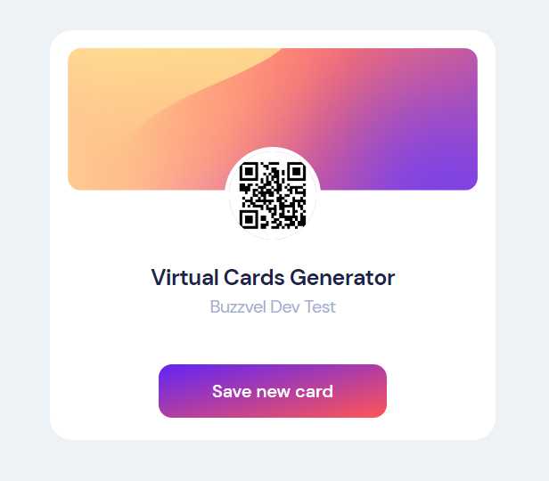

<a name="readme-top"></a>

<!-- PROJECT SHIELDS -->

[](https://www.linkedin.com/in/daniel-pimenta-cc/)

<!-- PROJECT LOGO -->

<br />
<div align="center">
  <a href="https://whereis420.app/">
    
  </a>

<a href="https://whereis420.app/"><h3 align="center">Virtual Card Generator</h3></a>

<p align="center">
    Project created for Buzzvel’s admission test. The task was to create a website for virtual business cards where the user could register information and generate a QR code that leads to a page with the registered information when scanned..
    <br />
    <a href="https://github.com/daniel-pimenta-cc/whereis420"><strong>Explore the docs »</strong></a>
    <br />
    <br />
    <a href="https://whereis420.app/">View Demo</a>
  </p>
</div>

<!-- TABLE OF CONTENTS -->

<details>
  <summary>Table of Contents</summary>
  <ol>
    <li>
      <a href="#about-the-project">About The Project</a>
      <ul>
        <li><a href="#built-with">Built With</a></li>
      </ul>
    </li>
    <li>
      <a href="#getting-started">Getting Started</a>
      <ul>
        <li><a href="#prerequisites">Prerequisites</a></li>
        <li><a href="#installation">Installation</a></li>
      </ul>
    </li>
    <li><a href="#contact">Contact</a></li>
  </ol>
</details>

<!-- ABOUT THE PROJECT -->

## About The Project

[![Product Name Screen Shot][product-screenshot]](https://example.com)

4:20 World Clock is a website that shows the next location in the world that will be 4:20. It was inspired by a joke with friends who always checked the time in different parts of the world when they smoked and "paid tribute" to that place. The site displays the next 4:20 time, and displays a funny animation of a joint if the time is between 4:20 and 4:30. Otherwise, it displays a countdown to the next 4:20. Additionally, the site always displays interesting information about the location, such as the local time.

<p align="right">(<a href="#readme-top">back to top</a>)</p>

### Built With

* [](https://laravel.com/)
* [](https://www.mysql.com/)
* [](https://tailwindcss.com/)


<p align="right">(<a href="#readme-top">back to top</a>)</p>

<!-- GETTING STARTED -->

## Getting Started

To get a local copy up and running follow these simple example steps.

### Prerequisites

* PHP
* Composer
* MySQL

Before starting the project, make sure you have PHP, Composer and MySQL installed on your machine.

### Installation


1. Clone the repo
   ```sh
   git clone https://github.com/daniel-pimenta-cc/virtual-card-generator
   ```
2. Enter the project folder 
   ```sh
   cd virtual-card-generator
   ```
3. Create .env file and configure your database

4. Download dependencies
   ```sh
   composer install
   ```

5. Create database tables
   ```sh
   php artisan migrate
   ```

6. Run 
   ```sh
   php artisan serve
   ```

<p align="right">(<a href="#readme-top">back to top</a>)</p>

<!-- CONTACT -->

## Contact

Daniel Pimenta - [Linkedin](https://www.linkedin.com/in/daniel-pimenta-cc/) - danipimentasousa@gmail.com

Project Link: [https://github.com/daniel-pimenta-cc/virtual-card-generator](https://github.com/daniel-pimenta-cc/virtual-card-generator)

<p align="right">(<a href="#readme-top">back to top</a>)</p>


[product-screenshot]: Screenshot.png
